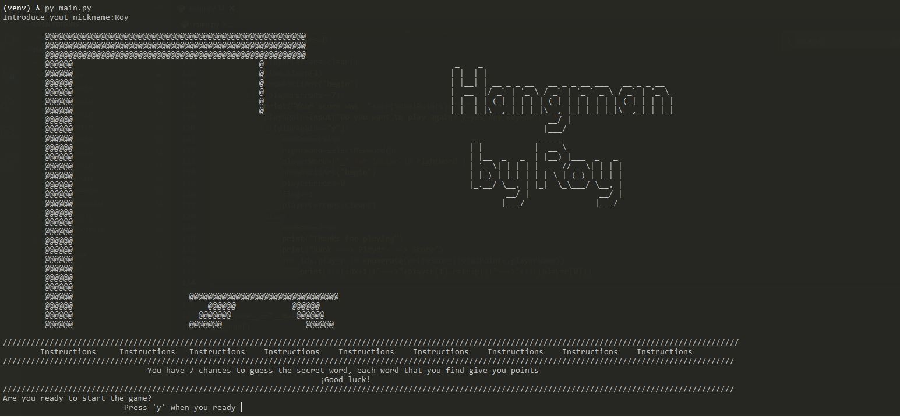
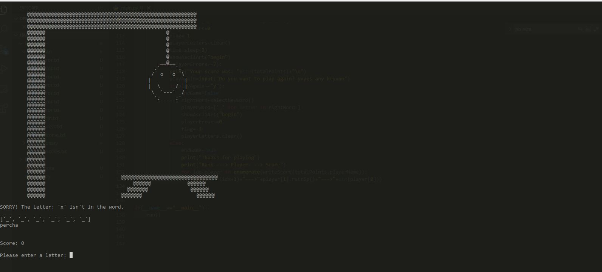
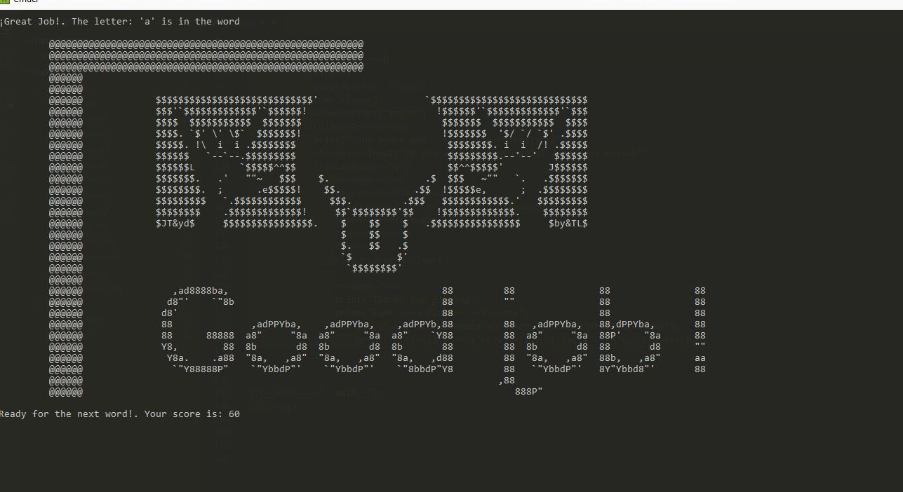
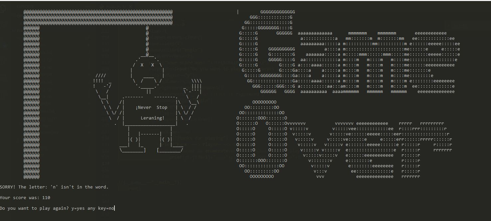
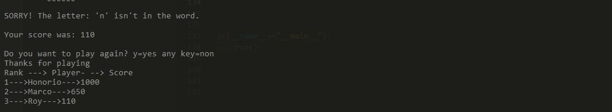

# Hangman_Game
My version of the classic game of hangman, enjoy it!🚀🚀

The game is totally in console with python.

The game includes an Score System,Funny stages with AsciiArt and a dictionary with some words to start to play.

# How to run the game? ⚙

Just run the file main.py and that's it, enjoy the game 😋

# Python Version 3.8
